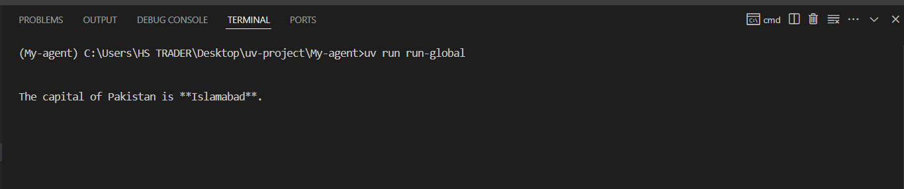

Here’s the README.md file for documentation:

This project demonstrates a simple AI agent built using the OpenAI Agent SDK structure but powered by the **Google Gemini API**. The agent answers a basic question using natural language processing and follows best practices such as using a `.env` file for secrets and UV for script execution.

---

## 🧠 What Does This Agent Do?

- Loads the Gemini API key securely from a `.env` file.
- Creates an AI assistant agent using the Gemini model (`gemini-2.0-flash`).
- Asks the question: **"What is the capital of Pakistan?"**
- Receives and prints the response using the Gemini API.

## ⚙️ Step-by-Step Instructions

### 1. Initialize the Project Using UV

```bash

uv init My-agent
cd my-agent

### 2. Install Dependencies

uv add python_dotenv

uv add openai-agents

### 3. Create a .env File in the Root Directory

GEMINI_API_KEY=your-gemini-api-key-here

▶️ Run the Agent
Add the following script section to your pyproject.toml:

[project.scripts]
run-global = "my_agent.global_config:run_global"

Then run the agent using:

uv run run-global

🖼️ Screenshot:
Add a screenshot of your terminal output here after successful execution.




